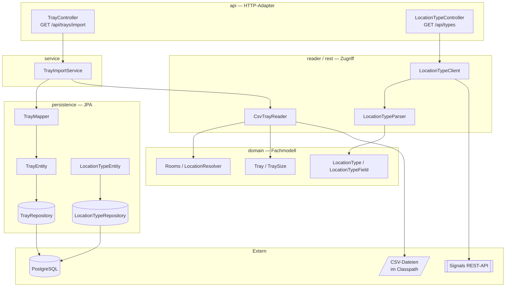
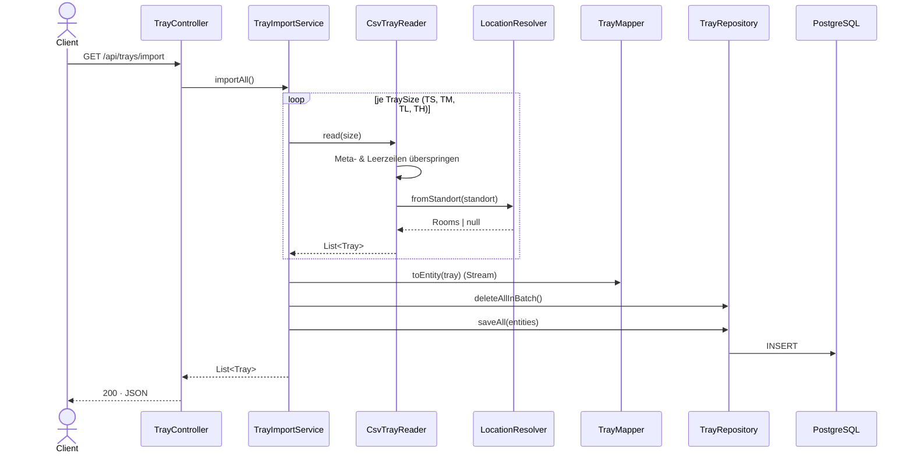
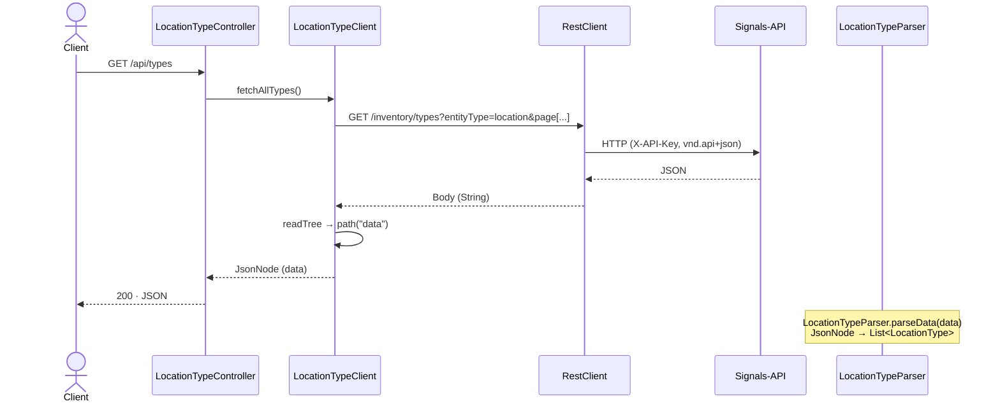
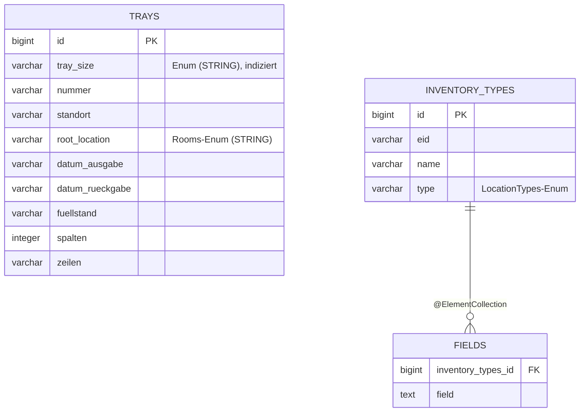

# Trays Creator

> Spring-Boot-Service, der Labor-**Trays** aus CSV-Dateien und **Location-Typen** aus der externen
> **Signals**-Inventory-API einliest, in ein sauberes Domänenmodell überführt und in PostgreSQL persistiert.

`Java 17` · `Spring Boot 4.1` · `Spring Data JPA` · `Spring RestClient` · `Jackson 3` · `PostgreSQL` · `Lombok` · `Maven`

---

## Inhalt

- [Überblick](#überblick)
- [Systemarchitektur](#systemarchitektur)
- [Kernkonzepte](#kernkonzepte)
- [Datenflüsse](#datenflüsse)
  - [Fluss 1 — Tray-Import aus CSV](#fluss-1--tray-import-aus-csv)
  - [Fluss 2 — Location-Typen aus der Signals-API](#fluss-2--location-typen-aus-der-signals-api)
- [Modulübersicht](#modulübersicht)
- [HTTP-API](#http-api)
- [Datenmodell & Persistenz](#datenmodell--persistenz)
- [Konfiguration](#konfiguration)
- [Setup & Ausführung](#setup--ausführung)
- [Tests](#tests)
- [Projektstruktur](#projektstruktur)

---

## Überblick

Trays Creator verwaltet die Lagerort-Hierarchie eines Labor-Inventars. Trays bilden die unterste Ebene — die physischen Behälter mit Raster, die die Proben aufnehmen; größere Lagerorte (Räume, Kühlschränke, Regale) bilden den Rahmen darum. Der Dienst bündelt zwei Quellen: konkrete Tray-Instanzen aus CSV und die Typ-Definitionen aller Lagerort-Arten aus der Signals-API.

| Quelle | Was kommt rein | Ergebnis |
|--------|----------------|----------|
| **CSV-Dateien** (Classpath) | Vier Tray-Größen (`TS`, `TM`, `TL`, `TH`) mit Nummer, Standort, Füllstand, Raster | Persistierte `Tray`-Datensätze in Postgres |
| **Signals-API** (REST) | Location-Typen (`Room`, `Refrigerator`, `Freezer`, `Bench`, `Shelf`, `Tray`) samt Feld-Definitionen | Geparste `LocationType`-Objekte |

Die Anwendung ist bewusst in klare Schichten getrennt: HTTP-Adapter, fachliches Domänenmodell,
REST-/CSV-Zugriff und JPA-Persistenz sind voneinander entkoppelt. Das Domänenmodell (`record`-Typen
und Enums) kennt weder Hibernate noch Jackson — die Übersetzung übernehmen dedizierte Mapper und Parser.

---

## Systemarchitektur



Zentrale Konfiguration liefert `ClientConfig`, das aus `SignalsTrialProperties`
(`trial.signals.*`) einen vorkonfigurierten `RestClient` als Spring-Bean bereitstellt.

---

## Kernkonzepte

### Trennung Domäne ↔ Infrastruktur
Das Fachmodell besteht aus unveränderlichen `record`-Typen (`Tray`, `LocationType`,
`LocationTypeField`) und Enums (`TraySize`, `Rooms`, `LocationTypes`). Diese Typen sind frei von
Persistenz- oder Serialisierungs-Annotationen. Für jede Außenwelt gibt es einen Übersetzer:

- `CsvTrayReader` — CSV-Zeile → `Tray`
- `LocationTypeParser` — JSON-Knoten → `LocationType`
- `TrayMapper` — `Tray` ↔ `TrayEntity` (statische, seiteneffektfreie Übersetzung)

### Raum-Auflösung
`LocationResolver` leitet aus dem rohen `standort`-String (z. B. `R003.K3`) per Präfix-Match die
Root-`Rooms`-Konstante ab. Der String wird normalisiert (trim, Großschreibung, Punkte/Leerzeichen
entfernt) und gegen die kuratierte Raumliste geprüft. Werte ohne bekannten Raum liefern `null`.

### Idempotenter Import
`TrayImportService.importAll()` läuft in einer Transaktion, leert die Tabelle
(`deleteAllInBatch`) und schreibt anschließend neu. Damit ist der Import beliebig oft wiederholbar,
ohne Duplikate aufzubauen.

### Signals-API-Konventionen
Der `RestClient` sendet `X-API-Key` und `Accept: application/vnd.api+json`. Location-Typen werden
seitenweise über `page[offset]`/`page[limit]` (Limit 100) und gefiltert per `entityType=location`
abgefragt. JSON wird mit **Jackson 3** (`tools.jackson.*`) navigiert — durchgängig über
`path(...)` statt `get(...)`, damit fehlende Knoten als `MissingNode` (nie `null`) auftreten.

---

## Datenflüsse

### Fluss 1 — Tray-Import aus CSV



Die CSVs folgen einem festen Aufbau: Zeile 1 = `Traygröße: XX`, Zeile 2 = Spaltenüberschriften,
danach Datenzeilen im Wechsel mit Leerzeilen (`;;;;;;`). Der Reader überspringt Meta- und Leerzeilen
und splittet an `;`. Nicht-numerische `Spalten`-Werte werden mit Warn-Log auf `null` gesetzt.

### Fluss 2 — Location-Typen aus der Signals-API



`LocationTypeParser` extrahiert aus jedem `data`-Element `attributes.id`, `attributes.name` sowie
die verschachtelten `fields` (mit `definition.title` und `definition.isRequired`) und bildet daraus
`LocationType`- und `LocationTypeField`-Objekte. Der Name wird über `LocationTypes.fromName(...)`
auf das interne Enum abgebildet.

---

## Modulübersicht

| Package | Verantwortung | Wichtige Typen |
|---------|---------------|----------------|
| `api` | HTTP-Adapter (REST-Controller) | `TrayController`, `LocationTypeController` |
| `service` | Orchestrierung des Imports | `TrayImportService` |
| `reader` | CSV lesen & parsen | `CsvTrayReader` |
| `rest` | Zugriff auf die Signals-API | `LocationTypeClient`, `LocationTypeParser`, `TraysClient` |
| `domain` | Fachliches Modell (immutable) | `Tray`, `TraySize`, `Rooms`, `LocationResolver`, `LocationType`, `LocationTypeField`, `LocationTypes` |
| `persistence` | JPA-Entities, Repositories, Mapper | `TrayEntity`, `TrayMapper`, `TrayRepository`, `LocationTypeEntity`, `LocationTypeRepository` |
| `config` | RestClient- & Property-Bindung | `ClientConfig`, `SignalsTrialProperties` |

---

## HTTP-API

| Methode | Pfad | Beschreibung | Antwort |
|---------|------|--------------|---------|
| `GET` | `/api/trays/import` | Liest alle vier Tray-CSVs, ersetzt den DB-Inhalt und gibt die importierten Trays zurück | `List<Tray>` (JSON) |
| `GET` | `/api/types` | Fragt die Location-Typen (`entityType=location`) von der Signals-API ab | Roher `data`-Knoten (JSON) |

Beispiel:

```bash
curl http://localhost:8080/api/trays/import
curl http://localhost:8080/api/types
```

---

## Datenmodell & Persistenz



**Tabellen**

- **`trays`** — eine Zeile pro importiertem Tray. Enum-Spalten (`tray_size`, `root_location`) werden
  als `STRING` gespeichert; auf `tray_size` liegt der Index `idx_trays_tray_size`.
  Das Repository bietet `findByTraySize(TraySize)`.
- **`inventory_types`** — ein Location-Typ pro Zeile, mit zugehöriger Feldliste in der
  Collection-Tabelle **`fields`** (`@ElementCollection`).

Das Schema wird per `spring.jpa.hibernate.ddl-auto=update` aus den Entities abgeleitet.

---

## Konfiguration

Konfiguriert wird über `application.properties`; sensible Werte kommen aus einer optionalen
`.env.properties` im Projektwurzelverzeichnis (`spring.config.import=optional:file:./.env.properties`).

| Property | Zweck | Herkunft |
|----------|-------|----------|
| `trial.signals.base-url` | Basis-URL der Signals-API | `${base_url}` aus `.env.properties` |
| `trial.signals.api-key` | API-Schlüssel (`X-API-Key`-Header) | `${api_key}` aus `.env.properties` |
| `spring.datasource.url` | `jdbc:postgresql://localhost:5430/data` | `application.properties` |
| `spring.datasource.username` / `password` | DB-Zugang | `application.properties` |
| `spring.jpa.hibernate.ddl-auto` | Schema-Strategie (`update`) | `application.properties` |

Die Properties `trial.signals.*` werden typsicher über `SignalsTrialProperties`
(`@ConfigurationProperties`) gebunden.

**`.env.properties` (Vorlage)**

```properties
base_url=https://<signals-host>/api
api_key=<dein-api-key>
```

---

## Setup & Ausführung

### Voraussetzungen
- JDK 17
- PostgreSQL, erreichbar unter `localhost:5430`, Datenbank `data`, User `user` / Passwort `admin123`
  (oder passe `application.properties` an)

Beispiel via Docker:

```bash
docker run --name trays-db -e POSTGRES_DB=data \
  -e POSTGRES_USER=user -e POSTGRES_PASSWORD=admin123 \
  -p 5430:5432 -d postgres
```

### Starten

```bash
# 1) .env.properties mit base_url + api_key anlegen (siehe oben)
# 2) Anwendung starten
./mvnw spring-boot:run
```

Die App läuft anschließend auf `http://localhost:8080`.

### Bauen

```bash
./mvnw clean package
java -jar target/trays_creator-0.0.1-SNAPSHOT.jar
```

---

## Tests

```bash
./mvnw test
```

Reine Unit-Tests mit **JUnit 5** und **AssertJ**, ohne Spring-Context oder Datenbank.
`LocationTypeParserTest` prüft den Parser gegen eine JSON-Fixture
(`src/test/resources/fixtures/inventory-types.json`).

---

## Projektstruktur

```
src/main/java/com/location/creator/
├── CreatorApplication.java        # Spring-Boot-Einstiegspunkt
├── api/                           # REST-Controller
│   ├── TrayController.java
│   └── LocationTypeController.java
├── service/
│   └── TrayImportService.java     # Import-Orchestrierung (transaktional)
├── reader/
│   └── CsvTrayReader.java         # CSV → Tray
├── rest/                          # Signals-API-Zugriff
│   ├── LocationTypeClient.java
│   ├── LocationTypeParser.java
│   └── TraysClient.java
├── domain/                        # Fachmodell (records + enums)
│   ├── Tray.java · TraySize.java
│   ├── Rooms.java · LocationResolver.java
│   └── LocationType.java · LocationTypeField.java · LocationTypes.java
├── persistence/                   # JPA
│   ├── TrayEntity.java · TrayMapper.java · TrayRepository.java
│   └── LocationTypeEntity.java · LocationTypeRepository.java
└── config/
    ├── ClientConfig.java          # RestClient-Bean
    └── SignalsTrialProperties.java

src/main/resources/
├── application.properties
└── csv/                           # ts_/tm_/tl_/th_trays.csv
```
